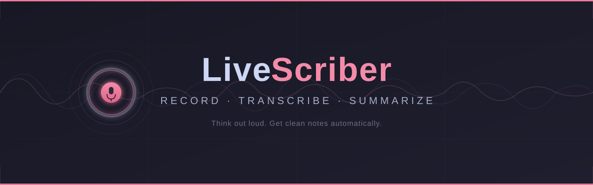

# LiveScriber

  

  <b>Talk. Get notes.</b> 
  Record your voice and turn it into clean, organized notes — automatically. 
  Available on <b>Windows</b>, <b>macOS</b>, <b>Linux</b>, and <b>Android</b>.

  
  
  

  

---

## � Available Platforms

| Platform | Status | Get It |
|----------|--------|--------|
| 🐧🍎🪟 **Desktop** (Windows, macOS, Linux) | ✅ Released | [Download](https://github.com/appatalks/LiveScriber/releases) |
| 📱 **Android** (Play Store) | ✅ Released | [Google Play](https://play.google.com/store/apps/details?id=com.appatalks.livescriber) |
| 📱 **Android** (Release Candidate) | 🔧 Available | [Latest RC](https://github.com/appatalks/LiveScriber/releases) |

---

## 🚀 Get Started (Desktop)

Download the latest version from [**Releases**](https://github.com/appatalks/LiveScriber/releases) and run the installer.

> Building from source? See the [Installation Guide](DOCS.md#install-from-source).

---

## 💡 How It Works

| Step | What happens |
|------|-------------|
| 🎙️ **Record** | Click the mic button — captures your voice and system audio |
| ⏹️ **Stop** | Click again to stop recording |
| 📝 **Transcribe** | Speech is converted to text locally (no internet needed) |
| ✨ **Summarize** | AI generates clean, structured notes from your transcript |
| 📋 **Export** | Copy to clipboard or save as Markdown |

---

## 🎯 Features

| | |
|---|---|
| 🪟 **Floating window** | Always-on-top — stays visible while you work |
| 🎤 **Mic + system audio** | Captures both sides of calls |
| 🔒 **Fully offline** | Transcription runs locally on your machine |
| 🤖 **Built-in AI notes** | Summarizes using a local model — no account or API key needed |
| 🔄 **Session history** | Flip between past recordings with ◀ ▶ |
| 📂 **Import audio** | Bring in WAV, MP3, M4A, and more |
| 🎨 **Dark & light themes** | Switch in Settings |
| 🌐 **Multi-language** | UI and summaries in 9 languages |
| ⚙️ **Fully configurable** | Model, backend, prompt, opacity — all adjustable |

> 📱 **Android** adds on-device llama.cpp inference, background recording, and audio import with auto-transcoding. [See Android details →](LiveScriber-Android-README.md)

---

## ⚙️ Settings

Click the **⚙** gear icon in the title bar to adjust:

- 🧠 Transcription model (accuracy vs. speed)
- 🤖 Summarization backend (local, Copilot, Ollama, OpenAI)
- 🔊 System audio capture
- 🎨 Theme and opacity

Settings are saved automatically.

---

## 📖 Documentation

For installation from source, advanced configuration, CLI options, and developer info:

➡️ [**DOCS.md**](DOCS.md)

---

## 💚 Support

LiveScriber is free and open source. If it's useful to you, consider supporting development:

  

| | |
|---|---|
| **Bitcoin** | `16CowvxvLSR4BPEP9KJZiR622UU7hGEce5` |
| **Ethereum** | `0xf75278bd6e2006e6ef4847c9a9293e509ab815c5` |

---

## 🐛 Issues & Feature Requests

This repository is the **central hub** for all LiveScriber platforms. Please file bugs and feature requests here:

- 🖥️ [Desktop issue](https://github.com/appatalks/LiveScriber/issues/new?labels=desktop&title=%5BDesktop%5D+)
- 📱 [Android issue](https://github.com/appatalks/LiveScriber/issues/new?labels=android&title=%5BAndroid%5D+)
- 💬 [General discussion](https://github.com/appatalks/LiveScriber/discussions)

---

## 🔒 Privacy

LiveScriber is privacy-first. Transcription always runs on-device. No analytics, no ads, no tracking.

➡️ [**Privacy Policy**](PRIVACY.md)

---

  MIT License · Made with 🎙️ by <a href="https://github.com/appatalks">appatalks</a>

