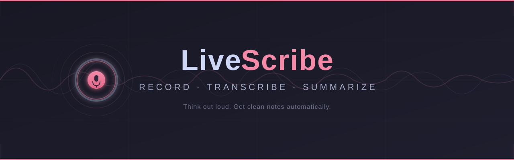

# LiveScribe

  

  <b>Talk. Get notes.</b> 
  A floating desktop app that records your voice and turns it into clean, organized notes — automatically.

  
  

---

## 🚀 Get Started

Download the latest version from [**Releases**](https://github.com/appatalks/LiveScribe/releases) and run the installer.

> Building from source? See the [Installation Guide](DOCS.md#install-from-source).

---

## 💡 How It Works

| Step | What happens |
|------|-------------|
| 🎙️ **Record** | Click the mic button — captures your voice and system audio |
| ⏹️ **Stop** | Click again to stop recording |
| 📝 **Transcribe** | Speech is converted to text locally (no internet needed) |
| ✨ **Summarize** | AI generates clean, structured notes from your transcript |
| 📋 **Export** | Copy to clipboard or save as Markdown |

---

## 🎯 Features

| | |
|---|---|
| 🪟 **Floating window** | Always-on-top — stays visible while you work |
| 🎤 **Mic + system audio** | Captures both sides of calls |
| 🔒 **Fully offline** | Transcription runs locally on your machine |
| 🤖 **Built-in AI notes** | Summarizes using a local model — no account or API key needed |
| 🔄 **Session history** | Flip between past recordings with ◀ ▶ |
| 📂 **Import audio** | Bring in WAV, MP3, M4A, and more |
| 🎨 **Dark & light themes** | Switch in Settings |
| ⚙️ **Fully configurable** | Model, backend, prompt, opacity — all adjustable |

---

## ⚙️ Settings

Click the **⚙** gear icon in the title bar to adjust:

- 🧠 Transcription model (accuracy vs. speed)
- 🤖 Summarization backend (local, Copilot, Ollama, OpenAI)
- 🔊 System audio capture
- 🎨 Theme and opacity

Settings are saved automatically.

---

## 📖 Documentation

For installation from source, advanced configuration, CLI options, and developer info:

➡️ [**DOCS.md**](DOCS.md)

---

## 💚 Support

LiveScribe is free and open source. If it's useful to you, consider supporting development:

  

| | |
|---|---|
| **Bitcoin** | `16CowvxvLSR4BPEP9KJZiR622UU7hGEce5` |
| **Ethereum** | `0xf75278bd6e2006e6ef4847c9a9293e509ab815c5` |

---

  MIT License · Made with 🎙️ by <a href="https://github.com/appatalks">appatalks</a>

